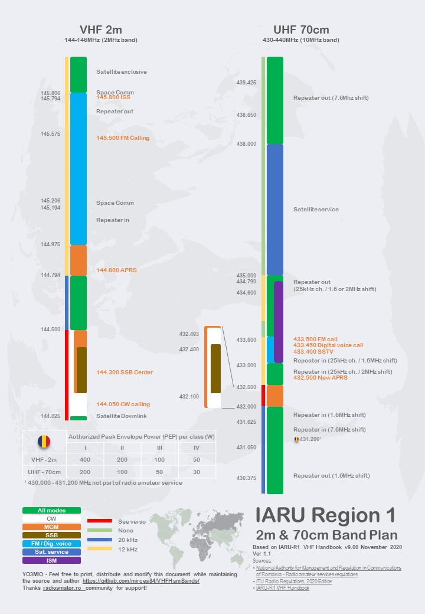

# VHFHamBands
VHF Ham Bands Infografic

IARU Region 1 - 2m & 70cm Band Plans, based on IARU-R1 VHF Handbook v9.00 (November 2020 edition)

Feel free to print, distribute and modify this document while maintaining the source and author. 
Thanks [radioamator.ro](https://radioamator.ro) community for support!

Sources:
- [National Authority for Management and Regulation in Communications of Romania - Radio amateur services regulations](http://www.ancom.ro/radioamatori_2899)
- [ITU Radio Regulations, 2020 Edition](https://www.itu.int/pub/R-REG-RR)
- [IARU-R1 VHF Handbook](https://www.iaru-r1.org/reference/handbooks/)

